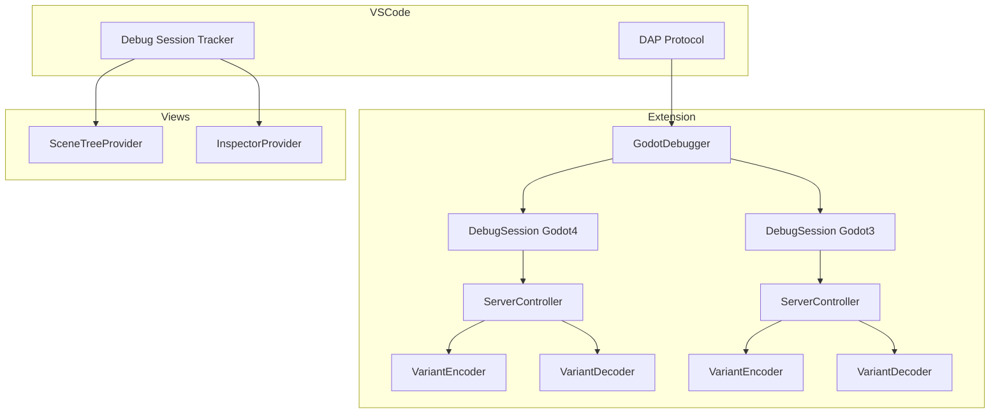

# Debugger

GDScript debugger implementation supporting both Godot 3 and Godot 4.

## Architecture



## Key Components

### GodotDebugger

Main entry point in `src/debugger/debugger.ts`. Registers the debug adapter factory and manages debug sessions.

### DebugSession

Implements `vscode.DebugSession` for DAP communication:

- **Godot 4**: `src/debugger/godot4/debug_session.ts`
- **Godot 3**: `src/debugger/godot3/debug_session.ts`

### ServerController

Manages TCP communication with Godot's debug server:

- Establishes connection on launch
- Handles stepping, breakpoints, variable requests
- Godot 4 uses port 6007 by default

### Variant Encoder/Decoder

Serialize/deserialize Godot values for transmission:

- Godot 4: JSON-based encoding with type metadata
- Godot 3: Binary protocol with variant type tags

### Scene Tree & Inspector

Debug views during active debugging:

- `SceneTreeProvider` - Shows active node hierarchy
- `InspectorProvider` - Shows properties of selected node

## Launch Configuration

```json
{
  "name": "GDScript: Launch Project",
  "type": "godot",
  "request": "launch",
  "project": "${workspaceFolder}",
  "scene": "main|current|pinned|<path>",
  "address": "127.0.0.1",
  "port": 6007
}
```

## Key Files

| File | Purpose |
|------|---------|
| `debugger.ts` | Extension entry point, factory registration |
| `debug_runtime.ts` | Runtime state management |
| `scene_tree_provider.ts` | Active scene tree view |
| `inspector_provider.ts` | Node property inspector |
| `godot4/debug_session.ts` | Godot 4 debug session |
| `godot4/server_controller.ts` | Godot 4 TCP communication |
| `godot4/variables/` | Variant encoding/decoding |

## Commands

- `godotTools.debugger.debugCurrentFile` - Debug active file
- `godotTools.debugger.debugPinnedFile` - Debug pinned scene
- `godotTools.debugger.pinFile` / `unpinFile` - Pin a scene for debugging
- `godotTools.debugger.inspectNode` - Inspect remote node
- `godotTools.debugger.refreshSceneTree` - Refresh scene tree view
- `godotTools.debugger.refreshInspector` - Refresh inspector view

## Notes

- Debugger attaches to running Godot project or launches it
- Scene pinning allows quick re-debugging of specific scenes
- Variables are decoded from Godot's wire format to VS Code DAP types