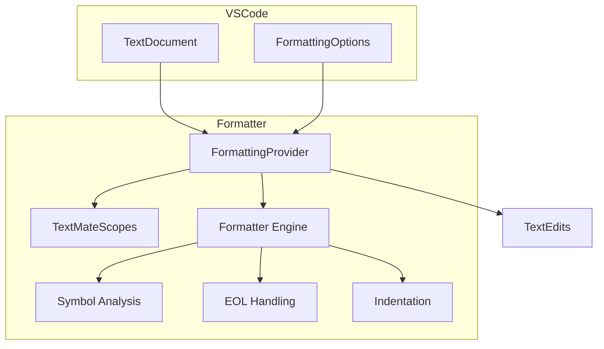

# Formatter

GDScript code formatter implementation.

## Architecture



## FormattingProvider

File: `src/formatter/formatter.ts`

Main formatter entry point implementing `vscode.DocumentFormattingEditProvider`.

### Features

- Indentation correction based on Python-style significant whitespace
- Empty line normalization (configurable: 1 or 2 lines)
- Trailing whitespace removal
- End-of-line comment spacing
- Dense parameter list formatting option

### Configuration

```json
{
  "godotTools.formatter.maxEmptyLines": "2",
  "godotTools.formatter.denseFunctionParameters": false,
  "godotTools.formatter.spacesBeforeEndOfLineComment": "1"
}
```

## Implementation Details

### TextMate Scope Integration

Uses VS Code's TextMate parsing to understand code structure:

- `source.gdscript` - Main scope
- `entity.name.function` - Function definitions
- `storage.type` - Type annotations

### Symbol Analysis

The formatter analyzes:

- Function definitions for parameter lists
- Class definitions for inheritance
- Control flow statements for body structure

### Indentation Strategy

GDScript uses Python-like indentation. The formatter:

1. Detects dedent keywords (`else`, `elif`, `except`)
2. Tracks nested blocks
3. Corrects misaligned indentation
4. Preserves multiline constructs

## Key Files

| File | Purpose |
|------|---------|
| `formatter.ts` | Main formatting logic |
| `symbols.ts` | Symbol analysis utilities |
| `textmate.ts` | TextMate scope utilities |
| `index.ts` | Module exports |

## Testing

Unit tests in `src/formatter/formatter.test.ts` with snapshot files in `src/formatter/snapshots/`.

Test approach:

1. Input GDScript file
2. Apply formatting
3. Compare against expected output snapshot

## Notes

- Formatter runs on full document, not incremental
- Formatting occurs on save (if format on save enabled)
- Works with `.gd` files only (GDScript)
- Does not modify strings or comments inside

## Future

See [plans/formatter-refactor.md](../plans/formatter-refactor.md) for plans to rewrite using Tree-sitter AST-based parsing to add:
- Full indentation fixing
- Line length wrapping
- Code organization (import/signal sorting)