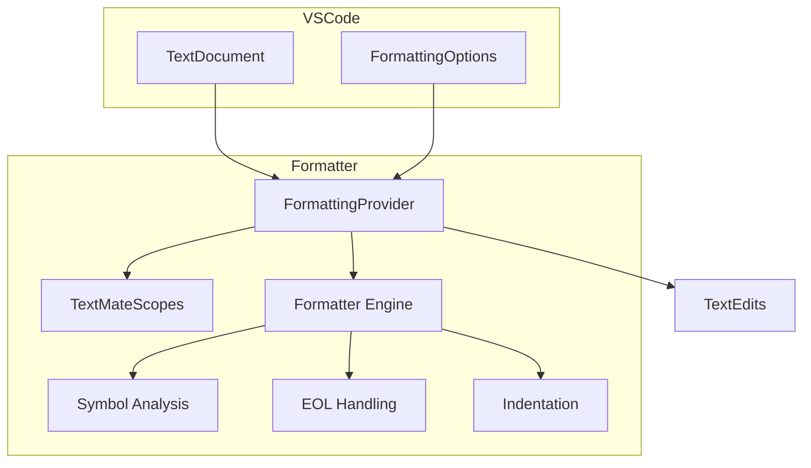

# Formatter

GDScript code formatter implementation.

## Current Status: Lezer Refactor In Progress

The formatter is being refactored from TextMate-based to Lezer-based AST parsing. See [plans/formatter-refactor.md](../plans/formatter-refactor.md) for full plan and progress tracking.

### Lezer Parser Status (2026-05-03)

**Top-level grammar** works (30/30 unit tests), but cannot parse function bodies or indented blocks yet.

**Breakthrough (this session):** A minimal grammar with indentation tracking (`test-indent.grammar`) generates correctly, producing external token IDs (`indent`, `dedent`, `newline`, etc.) and bundling via Rollup. This proves the Python Lezer pattern works for GDScript.

#### What parses now (without indentation)
- Top-level declarations (class_name, extends, signals, vars, funcs, enums)
- All expression types (binary ops, calls, member access, arrays, dicts)
- Function signatures with parameters and return types
- Multi-line newlines-as-whitespace code

#### What doesn't parse yet
- Function bodies (indented blocks)
- Control flow bodies (if/for/while blocks)
- Real-world pass rate: ~6.7% (39/585 files)

### Key Insight: How External Tokens Work

The previous session got stuck because `gdscript.grammar` didn't generate external token IDs. The root cause: the grammar must be structured exactly right. The working pattern (proven in `test-indent.grammar`):

```lezer
@context trackIndent from "./tokens.js"

@external tokens indentation from "./tokens" { indent, dedent }
@external tokens newlines from "./tokens" { newline, blankLineStart, newlineBracketed, eof }

@skip {} {
  blankLine { blankLineStart space? Comment? (newline | eof) }
}
```

Crucially:
- `@context` declaration must be present
- `blankLine` is a **rule** composed of external tokens, not an external token itself
- The `@skip {}` block (with empty skip) defines `blankLine` separately from the main `@skip`
- `tokens.js` imports term IDs from the **generated** `.terms.js` file
- Rollup bundles `parser.js` + `tokens.js` into a single distributable

### Build Pipeline

```
gdscript.grammar
    → lezer-generator → generated/gdscript.js + generated/gdscript.terms.js
    → tokens.js imports from generated/gdscript.terms.js
    → rollup bundles generated/gdscript.js + tokens.js → dist/index.js + dist/index.cjs
```

The Python Lezer package (`@lezer/python`) uses this exact same pattern. See `node_modules/@lezer/python/` for reference.

### File Layout

```
src/formatter/grammar/
├── gdscript.grammar          # Grammar (needs rebuild from test-indent base)
├── test-indent.grammar       # PROVEN WORKING minimal grammar with indentation
├── tokens.ts / tokens.js     # External tokenizers (inconsistent state)
├── test-tokens.js             # Tokens file matching test-indent.grammar
├── generated/
│   ├── gdscript.js            # Generated from old grammar (no external tokens)
│   ├── gdscript.terms.js      # Missing indent/dedent/newline IDs
│   ├── test-indent.js         # Generated from test-indent.grammar (WORKING)
│   ├── test-indent.terms.js   # Has all external token IDs (WORKING)
│   └── tokens.js              # Tokens matching test-indent
├── dist/
│   ├── test-index.js          # Rollup bundle (ESM) - WORKING
│   └── test-index.cjs         # Rollup bundle (CJS)
└── test-running.mjs           # Test runner (has ESM/CJS import issue)
```

## Architecture (Current - TextMate-based)



## FormattingProvider

File: `src/formatter/formatter.ts`

Main formatter entry point implementing `vscode.DocumentFormattingEditProvider`.

### Features

- Indentation correction based on Python-style significant whitespace
- Empty line normalization (configurable: 1 or 2 lines)
- Trailing whitespace removal
- End-of-line comment spacing
- Dense parameter list formatting option

### Configuration

```json
{
  "godotTools.formatter.maxEmptyLines": "2",
  "godotTools.formatter.denseFunctionParameters": false,
  "godotTools.formatter.spacesBeforeEndOfLineComment": "1"
}
```

## Key Files

| File | Purpose |
|------|---------|
| `formatter.ts` | Main formatting logic |
| `symbols.ts` | Symbol analysis utilities |
| `textmate.ts` | TextMate scope utilities |
| `index.ts` | Module exports |

## Testing

Unit tests in `src/formatter/formatter.test.ts` with snapshot files in `src/formatter/snapshots/`.

## Notes

- Formatter runs on full document, not incremental
- Formatting occurs on save (if format on save enabled)
- Works with `.gd` files only (GDScript)