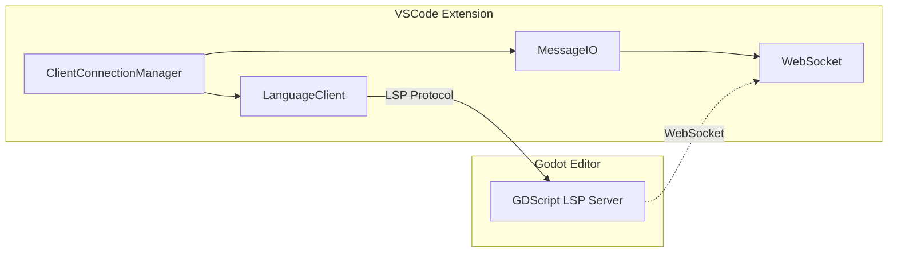
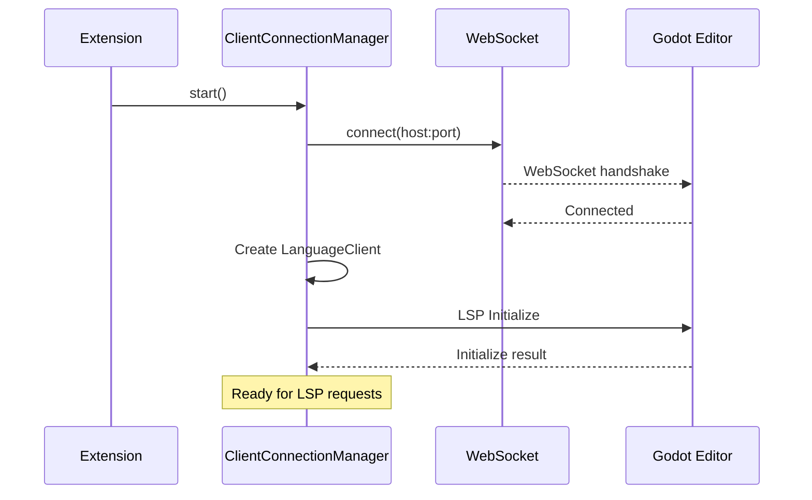

# LSP (Language Server Protocol)

Client implementation for connecting to Godot's built-in GDScript language server.

## Architecture



## Key Components

### ClientConnectionManager

Entry point in `src/lsp/ClientConnectionManager.ts`:

- Establishes WebSocket connection to Godot
- Creates and manages `LanguageClient` instance
- Handles auto-reconnect logic
- Manages connection state (disconnected, connecting, connected)

### MessageIO

Handles WebSocket message framing in `src/lsp/MessageIO.ts`:

- Reads/writes LSP messages over WebSocket
- Handles content-length headers and JSON-RPC format

### MessageBuffer

Efficient message parsing in `src/lsp/MessageBuffer.ts`:

- Buffers incoming data until complete message received
- Parses content-length delimited messages

### GDScriptLanguageClient

Extension of VS Code's `LanguageClient` in `src/lsp/GDScriptLanguageClient.ts`:

- Custom handling for Godot-specific LSP features
- Manages document sync and capabilities

## Connection Flow



## Configuration

```json
{
  "godotTools.lsp.serverHost": "127.0.0.1",
  "godotTools.lsp.serverPort": 6008,
  "godotTools.lsp.headless": false,
  "godotTools.lsp.autoReconnect.enabled": true,
  "godotTools.lsp.autoReconnect.cooldown": 3000,
  "godotTools.lsp.autoReconnect.attempts": 10
}
```

## Headless Mode

When `headless: true`, extension launches a headless Godot instance for the LSP:

1. Spawns `godot --headless --language-server`
2. Connects to spawned process
3. Terminates on extension deactivation

Available in Godot 3.6+ and Godot 4.2+.

## Key Files

| File | Purpose |
|------|---------|
| `ClientConnectionManager.ts` | LSP connection management |
| `GDScriptLanguageClient.ts` | Language client wrapper |
| `MessageIO.ts` | WebSocket message I/O |
| `MessageBuffer.ts` | Message buffering and parsing |
| `index.ts` | Module exports |

## Commands

- `godotTools.startLanguageServer` - Manually start LSP connection
- `godotTools.stopLanguageServer` - Disconnect from LSP