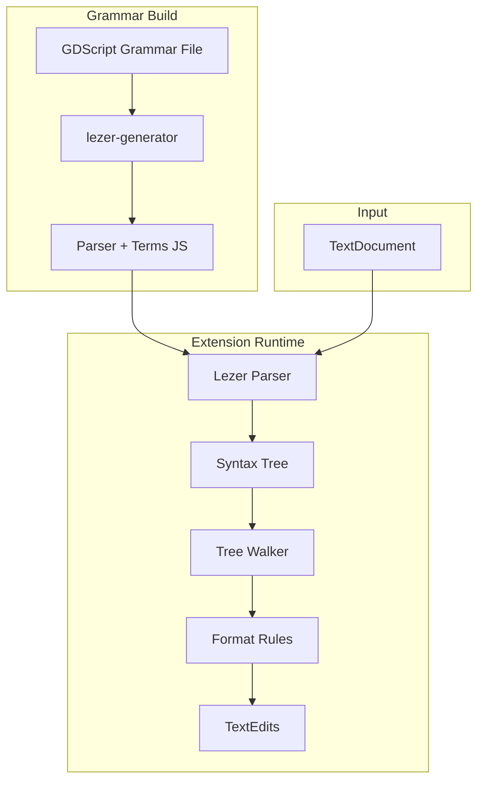

# Formatter Refactor Plan - Lezer MVP

Refactor the GDScript formatter from TextMate-based to Lezer-based AST parsing.

## Why Lezer?

- **Pure JavaScript** - No native compilation, WASM, or platform-specific builds
- **Easy packaging** - Just JS files in the extension bundle
- **Incremental parsing** - Efficient re-parsing on edits
- **Error recovery** - Produces usable trees even with syntax errors
- **JavaScript-first** - Designed for editor use cases (CodeMirror)
- **We control the grammar** - Can design for both Godot 3 & 4 from the start

## Goals (MVP)

1. **Indentation fixing** - Correct indentation based on block structure
2. **Spacing rules** - Same as current formatter, but AST-based
3. **Both Godot versions** - Grammar designed for GDScript 3 & 4

## Architecture



## File Structure

```
src/formatter/
├── index.ts              # Re-exports
├── formatter.ts          # FormattingProvider registration
├── parser.ts             # Lezer parser initialization
├── walker.ts             # Tree traversal utilities
├── rules/
│   ├── index.ts          # Rule orchestration
│   ├── indentation.ts    # Indentation fixing
│   ├── spacing.ts        # Token spacing (port from existing)
│   └── empty_lines.ts    # Empty line normalization
├── grammar/
│   ├── gdscript.grammar  # Lezer grammar definition
│   └── generated/        # Generated parser (gitignored)
└── textmate.ts           # OLD - remove after migration
```

## Grammar Design (GDScript)

The grammar needs to handle both Godot 3 and Godot 4 syntax. Key differences to handle:

### Permissive Grammar (No Dialects)

The grammar accepts **both** GDScript 3 and 4 syntax simultaneously. No version detection needed.

| Feature | GDScript 3 | GDScript 4 | Grammar |
|---------|-------------|------------|---------|
| Exports | `export var x = 5` | `@export var x = 5` | Accept both forms |
| Onready | `onready var x` | `@onready var x` | Accept both forms |
| RPC | `remote func`, `master func` | `@rpc` annotation | Accept both forms |
| Type inference | `var x := "str"` | Same | Same rule |
| Await | `yield(obj, "signal")` | `await signal` | Accept both forms |
| Typed arrays | `var arr: Array` | `var arr: Array[int]` | Optional type param |
| StringName | N/A | `&"name"` | Accept in all files |
| NodePath | `"path"` | `^"path"` or `"path"` | Accept both forms |

This matches the approach taken by the existing TextMate syntax highlighter - be permissive, don't validate semantics, just parse structure.

### Lezer Grammar MVP

```
@top Script { annotation* (class_name | extends)? signal* enum* const* var* func* }

@precedence { annotation, low }

@skip { space | Comment }

// Annotations (GDScript 4: @export, @onready, @rpc, etc.)
annotation { "@" identifier ("(" argList? ")")? }

// GDScript 3 style keywords (also valid contextually)
exportKeyword { @extend<identifier, "export"> }
onreadyKeyword { @extend<identifier, "onready"> }
rpcKeywords { @extend<identifier, "remote" | "master" | "puppet" | "sync"> }

// Class declaration
class_name { "class_name" identifier }
extends { "extends" (identifier | string) }

// Signals
signal { "signal" identifier ("(" paramList? ")")? }

// Enums  
enum { "enum" identifier? "{" enumEntries "}" }

// Variables - accepts both GDScript 3 and 4 styles
var {
  (annotation | rpcKeywords)*
  exportKeyword?
  onreadyKeyword?
  "var" identifier
  (":" type)?
  ("=" expression)?
}

// Functions
func {
  (annotation | rpcKeywords)*
  "static"?
  "func" identifier
  ("(" paramList? ")")?
  ("->" type)?
  ":" statement*
}

// Statements
statement {
  IfStatement |
  ForStatement |
  WhileStatement |
  MatchStatement |
  ReturnStatement |
  expression |
  Block
}

// Expressions
expression {
  BinaryExpression |
  UnaryExpression |
  CallExpression |
  MemberExpression |
  identifier |
  Number |
  String |
  StringName |    // &"..."
  NodePath |       // ^"..."
  // ... more expression types
}

@tokens {
  space { @whitespace+ }
  Comment { "#" ![\n]* }
  identifier { @asciiLetter+ }
  Number { @digit+ }
  String { '"' (![\\"\n] | Escape)* '"' | "'" (!['\\\n] | Escape)* "'" }
  // ...
}
```

**Key design principle:** If syntax is valid in either GDScript 3 or 4, the grammar accepts it. No version detection, no dialects, no validation errors for "mixed" code.

## Implementation Phases

### Phase 1: Grammar Foundation (3-4 days)

1. **Create basic grammar**
   ```bash
   # Install lezer tooling
   npm install @lezer/lr @lezer/generator @lezer/common --save
   
   # Create grammar file
   touch src/formatter/grammar/gdscript.grammar
   ```

2. **Build script setup**
   ```json
   // package.json
   {
     "scripts": {
       "build-grammar": "lezer-generator src/formatter/grammar/gdscript.grammar -o src/formatter/grammar/generated/gdscript.js"
     }
   }
   ```

3. **Start with minimal grammar**
   - Variables with type hints
   - Simple function definitions
   - Basic expressions
   - Comments

4. **Test parsing**
   ```typescript
   import { parser } from "./grammar/generated/gdscript";
   
   const tree = parser.parse(sourceCode);
   console.log(tree.toString());
   ```

### Phase 2: Core Formatting (2-3 days)

1. **Indentation from AST**
   ```typescript
   // walker.ts
   export function getIndentLevel(tree: Tree, line: number): number {
     // Walk up from position, count indent-increasing nodes
     // func, if, for, while, match, class
   }
   ```

2. **Spacing rules from existing code**
   - Port `between()` logic to use AST node types
   - Use tree cursor for traversal

3. **Empty line handling**
   - Walk top-level declarations
   - Normalize spacing between them

### Phase 3: Complete Grammar (3-4 days)

1. **Add remaining constructs**
   - Match statements with patterns
   - Lambda functions
   - Coroutines (yield/await)
   - Class inheritance
   - Inner classes

2. **Test with real files

### Phase 4: Integration (2 days)

1. **Replace TextMate formatter**
   - Use Lezer for `.gd` files
   - Remove TextMate code path

2. **Tests**
   - Port existing snapshot tests
   - Add tests for GDScript 3 files
   - Add tests for GDScript 4 files

## Risks & Mitigations

| Risk | Mitigation |
|------|------------|
| Grammar complexity | Start minimal, expand incrementally |
| Parse errors in malformed code | Lezer has built-in error recovery - produces partial trees |
| Performance | Lezer is designed for editor use, should be fast enough |
| Learning curve | Lezer docs are good, JS grammar is a reference |

## MVP Scope

**In scope for MVP:**
- Parse both GDScript 3 and 4
- Fix indentation
- Apply spacing rules
- Normalize empty lines

**Out of scope (future work):**
- Line wrapping
- Code organization (sorting)
- Comment formatting

## Progress Tracking

- [x] Setup Lezer dependencies and build script
- [x] Create minimal GDScript grammar
- [x] Fix grammar to properly recognize keywords (SOLVED 2026-04-12)
- [x] Add binary operators with precedence (SOLVED 2026-04-13)
- [x] Fix @ token for annotations (SOLVED 2026-04-13)
- [x] Fix $ token for node paths (SOLVED 2026-04-13)
- [x] Add function parameters and call arguments (SOLVED 2026-04-13)
- [x] Add array/dict literals and subscript (SOLVED 2026-04-13)
- [x] Add control flow keywords (if/elif/else, for, while, match, break, continue) (SOLVED 2026-04-14)
- [x] Add multi-line support (newlines as whitespace) (SOLVED 2026-04-14)
- [x] Parse all top-level constructs (class_name, extends, signals, vars, funcs, enums) (SOLVED 2026-04-14)
- [x] Implement indent/dedent external tokenizers (Python grammar pattern) - PROVEN in test-indent.grammar
- [ ] Add function bodies (indented blocks) - rebuild gdscript.grammar from test-indent base
- [ ] Wire up full build pipeline (lezer-generator + rollup + ESM/CJS output)
- [ ] Implement tree walker
- [ ] Implement indentation rule
- [ ] Port spacing rules
- [ ] Integration tests
- [ ] Remove old TextMate formatter

## Current Status (2026-05-03)

### Top-level grammar: 30/30 unit tests passing

Parses correctly without indentation:
- Variables, constants, function signatures, annotations, signals, enums, class headers
- All expression types (binary ops, calls, member access, arrays, dicts, subscripts)
- Multi-line code with newlines as whitespace

Real-world: ~6.7% (39/585 files) — limited by lack of indentation tracking.

### BREAKTHROUGH: Indentation Tracking Works

A minimal grammar (`test-indent.grammar`) **successfully generates** with external token IDs. The bundled parser (via Rollup) produces correct output. This proves the Python Lezer pattern works for GDScript.

**What was wrong before:** The previous `gdscript.grammar` had `@external tokens` and `@context` declarations, but the grammar structure didn't produce the external token IDs in the generated `.terms.js`. The root cause was likely a combination of: missing `@skip {}` block for `blankLine` rule, incorrect rule structure, or shift/reduce conflicts interfering with generation.

**The working pattern (from test-indent.grammar):**

```lezer
@skip { space | Comment | newlineBracketed | blankLine }

// ... grammar rules ...

Body { ":" (simpleStatement | newline indent statement+ (dedent | eof)) }

@context trackIndent from "./tokens.js"
@external tokens indentation from "./tokens" { indent, dedent }
@external tokens newlines from "./tokens" { newline, blankLineStart, newlineBracketed, eof }

// blankLine is a RULE using external tokens, not an external token itself
@skip {} {
  blankLine { blankLineStart space? Comment? (newline | eof) }
}

@tokens {
  space { $[ \t\f]+ }
  Comment { "#" ![\n\r]* }
  // ...
  "("[@export=ParenL] ")" "["[@export=BracketL] "]" "{"[@export=BraceL] "}"
}

@detectDelim
```

**Key rules:**
1. `@context trackIndent from "./tokens.js"` must be present
2. `blankLine` is a **rule** in a `@skip {}` block, composed of external tokens
3. Keywords must use `kw<term> { @specialize[@name={term}]<VariableName, term> }` — not bare strings that overlap with identifiers
4. `@detectDelim` at the end
5. `ParenL`, `BracketL`, `BraceL` exports needed so `tokens.js` can track bracketed contexts
6. `tokens.js` imports term IDs from the **generated** `.terms.js` file
7. Rollup bundles `parser.js` + `tokens.js` into a single distributable

### Build Pipeline (Proven Working)

```bash
# 1. Generate parser from grammar
npx lezer-generator src/formatter/grammar/test-indent.grammar -o src/formatter/grammar/generated/test-indent

# 2. Copy tokens.js next to generated parser (imports from ./test-indent.terms.js)
#    tokens.js must be in the same directory as the generated parser

# 3. Bundle with Rollup
npx rollup -c rollup.config.mjs
#    → dist/test-index.js (ESM)
#    → dist/test-index.cjs (CJS)
```

### Remaining Issue: ESM/CJS Import

The bundled CJS module doesn't expose `parser` as a named export for ESM imports. Need to either:
- Use `import pkg from './dist/test-index.js'; const { parser } = pkg;`
- Or configure Rollup to produce proper named exports

### Files in Working State

| File | Status |
|------|--------|
| `test-indent.grammar` | ✅ Generates correctly, has all external tokens |
| `generated/test-indent.js` | ✅ Generated parser with external token refs |
| `generated/test-indent.terms.js` | ✅ Has indent, dedent, newline, blankLineStart, etc. |
| `generated/tokens.js` | ✅ External tokenizers matching test-indent grammar |
| `dist/test-index.js` / `.cjs` | ✅ Rollup bundle |
| `gdscript.grammar` | ❌ Stale — needs rebuild from test-indent base |
| `tokens.ts` / `tokens.js` | ❌ Stale — inconsistent state from previous session |

### Next Steps

1. **Rebuild `gdscript.grammar`** — Start from `test-indent.grammar` structure and add GDScript-specific constructs (annotations, var decls, match, class, etc.) incrementally, running `lezer-generator` at each step
2. **Create proper `tokens.js`** — Match `tokens.ts`/`tokens.js` to the final grammar's term exports, add bracket tracking for `()`, `[]`, `{}` in GDScript-specific constructs
3. **Resolve ESM/CJS import** — Ensure the bundled parser can be imported from the extension's TypeScript code
4. **Test against real GDScript files** — Run the parser with indentation against the 585-file test corpus
5. **Implement tree walker** — Traverse AST for formatting
6. **Implement indentation rule** — Apply correct indentation based on AST structure

## Critical Discovery: Lezer Keyword Handling (SOLVED 2026-04-12)

### Root Causes Identified

1. **Inline @specialize doesn't create named tokens** - Must define keywords as separate rules
2. **Binary operators need @precedence** - Left-recursive rules need the `!tag` precedence marker

### Solution Pattern

```lezer
@precedence { expr @left }

// Keywords as separate rules
varKw { @specialize[@name=var]<identifier, "var"> }
funcKw { @specialize[@name=func]<identifier, "func"> }

// Binary operators with precedence tag
expr {
  expr !expr ("+" | "-") expr
  | expr !expr ("*" | "/" | "%") expr
  | identifier "(" argList? ")"
  | identifier
  | Number
}
```

## Grammar Progress (Session 2026-04-13)

### Real-World Testing

- **Pass rate:** 3.4% (20/584 files) 
- **Test sample passes:** 82.1% (23/28 test cases)

### Working Constructs

| Construct | Status |
|-----------|--------|
| `var x = 5` | ✅ |
| `var x: int = 5` | ✅ |
| `const X = 5` | ✅ |
| `func foo():` | ✅ |
| `signal test` | ✅ |
| `class_name Main` | ✅ |
| `extends Node` | ✅ |
| `enum { A, B }` | ✅ |
| `5 + 3`, `5 * 3`, etc. | ✅ |
| `foo()` | ✅ |
| `x.y` (member access) | ✅ |
| `"hello"`, `''` | ✅ |
| `true`, `false`, `null` | ✅ |
| `@export`, `@onready` | ✅ |
| `$"NodePath"` | ✅ |

### Remaining Issues

1. **Array literals** - `[1, 2]` not parsing (shift/reduce conflict)
2. **Dict literals** - `{}` not parsing
3. **Subscript** - `x[0]` not parsing (same conflict)
4. **Return type** - `func foo() -> void:` not parsing correctly

### Key Discovery About `@` Token (SOLVED)

The `@` character DOES work in Lezer - the issue was rule ordering. Put `"@" identifier` **first** in statement alternatives:

```lezer
statement {
  "@" identifier         // Must be FIRST!
  | classNameKw identifier
  | ...
}
```

The `$"NodePath"` syntax also works with `"$" String` in expressions.

## References

- [Lezer System Guide](https://lezer.codemirror.net/docs/guide/)
- [Lezer JavaScript Grammar](https://github.com/lezer-parser/javascript) (reference implementation)
- [@lezer/lr API](https://lezer.codemirror.net/docs/ref/#lr)
- [@lezer/generator](https://lezer.codemirror.net/docs/ref/#generator)
- [GDScript Style Guide](https://docs.godotengine.org/en/stable/tutorials/scripting/gdscript/gdscript_styleguide.html)