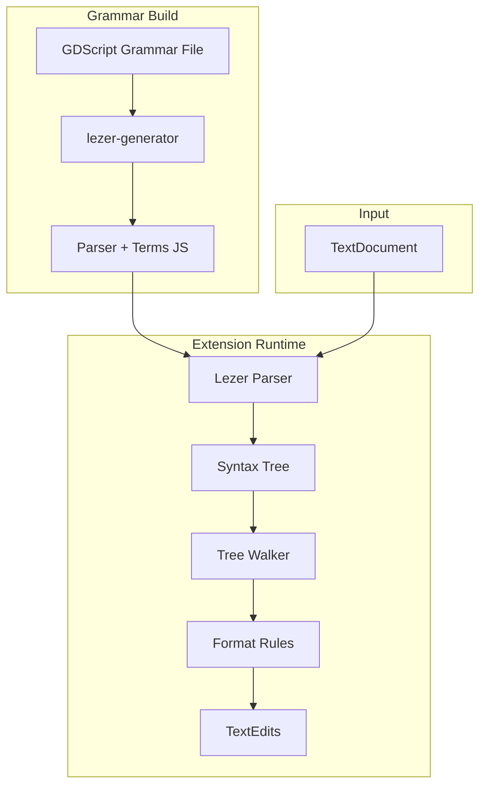

# Formatter Refactor Plan - Lezer MVP

Refactor the GDScript formatter from TextMate-based to Lezer-based AST parsing.

## Why Lezer?

- **Pure JavaScript** - No native compilation, WASM, or platform-specific builds
- **Easy packaging** - Just JS files in the extension bundle
- **Incremental parsing** - Efficient re-parsing on edits
- **Error recovery** - Produces usable trees even with syntax errors
- **JavaScript-first** - Designed for editor use cases (CodeMirror)
- **We control the grammar** - Can design for both Godot 3 & 4 from the start

## Goals (MVP)

1. **Indentation fixing** - Correct indentation based on block structure
2. **Spacing rules** - Same as current formatter, but AST-based
3. **Both Godot versions** - Grammar designed for GDScript 3 & 4

## Architecture



## File Structure

```
src/formatter/
├── index.ts              # Re-exports
├── formatter.ts          # FormattingProvider registration
├── parser.ts             # Lezer parser initialization
├── walker.ts             # Tree traversal utilities
├── rules/
│   ├── index.ts          # Rule orchestration
│   ├── indentation.ts    # Indentation fixing
│   ├── spacing.ts        # Token spacing (port from existing)
│   └── empty_lines.ts    # Empty line normalization
├── grammar/
│   ├── gdscript.grammar  # Lezer grammar definition
│   └── generated/        # Generated parser (gitignored)
└── textmate.ts           # OLD - remove after migration
```

## Grammar Design (GDScript)

The grammar needs to handle both Godot 3 and Godot 4 syntax. Key differences to handle:

### Permissive Grammar (No Dialects)

The grammar accepts **both** GDScript 3 and 4 syntax simultaneously. No version detection needed.

| Feature | GDScript 3 | GDScript 4 | Grammar |
|---------|-------------|------------|---------|
| Exports | `export var x = 5` | `@export var x = 5` | Accept both forms |
| Onready | `onready var x` | `@onready var x` | Accept both forms |
| RPC | `remote func`, `master func` | `@rpc` annotation | Accept both forms |
| Type inference | `var x := "str"` | Same | Same rule |
| Await | `yield(obj, "signal")` | `await signal` | Accept both forms |
| Typed arrays | `var arr: Array` | `var arr: Array[int]` | Optional type param |
| StringName | N/A | `&"name"` | Accept in all files |
| NodePath | `"path"` | `^"path"` or `"path"` | Accept both forms |

This matches the approach taken by the existing TextMate syntax highlighter - be permissive, don't validate semantics, just parse structure.

### Lezer Grammar MVP

```
@top Script { annotation* (class_name | extends)? signal* enum* const* var* func* }

@precedence { annotation, low }

@skip { space | Comment }

// Annotations (GDScript 4: @export, @onready, @rpc, etc.)
annotation { "@" identifier ("(" argList? ")")? }

// GDScript 3 style keywords (also valid contextually)
exportKeyword { @extend<identifier, "export"> }
onreadyKeyword { @extend<identifier, "onready"> }
rpcKeywords { @extend<identifier, "remote" | "master" | "puppet" | "sync"> }

// Class declaration
class_name { "class_name" identifier }
extends { "extends" (identifier | string) }

// Signals
signal { "signal" identifier ("(" paramList? ")")? }

// Enums  
enum { "enum" identifier? "{" enumEntries "}" }

// Variables - accepts both GDScript 3 and 4 styles
var {
  (annotation | rpcKeywords)*
  exportKeyword?
  onreadyKeyword?
  "var" identifier
  (":" type)?
  ("=" expression)?
}

// Functions
func {
  (annotation | rpcKeywords)*
  "static"?
  "func" identifier
  ("(" paramList? ")")?
  ("->" type)?
  ":" statement*
}

// Statements
statement {
  IfStatement |
  ForStatement |
  WhileStatement |
  MatchStatement |
  ReturnStatement |
  expression |
  Block
}

// Expressions
expression {
  BinaryExpression |
  UnaryExpression |
  CallExpression |
  MemberExpression |
  identifier |
  Number |
  String |
  StringName |    // &"..."
  NodePath |       // ^"..."
  // ... more expression types
}

@tokens {
  space { @whitespace+ }
  Comment { "#" ![\n]* }
  identifier { @asciiLetter+ }
  Number { @digit+ }
  String { '"' (![\\"\n] | Escape)* '"' | "'" (!['\\\n] | Escape)* "'" }
  // ...
}
```

**Key design principle:** If syntax is valid in either GDScript 3 or 4, the grammar accepts it. No version detection, no dialects, no validation errors for "mixed" code.

## Implementation Phases

### Phase 1: Grammar Foundation (3-4 days)

1. **Create basic grammar**
   ```bash
   # Install lezer tooling
   npm install @lezer/lr @lezer/generator @lezer/common --save
   
   # Create grammar file
   touch src/formatter/grammar/gdscript.grammar
   ```

2. **Build script setup**
   ```json
   // package.json
   {
     "scripts": {
       "build-grammar": "lezer-generator src/formatter/grammar/gdscript.grammar -o src/formatter/grammar/generated/gdscript.js"
     }
   }
   ```

3. **Start with minimal grammar**
   - Variables with type hints
   - Simple function definitions
   - Basic expressions
   - Comments

4. **Test parsing**
   ```typescript
   import { parser } from "./grammar/generated/gdscript";
   
   const tree = parser.parse(sourceCode);
   console.log(tree.toString());
   ```

### Phase 2: Core Formatting (2-3 days)

1. **Indentation from AST**
   ```typescript
   // walker.ts
   export function getIndentLevel(tree: Tree, line: number): number {
     // Walk up from position, count indent-increasing nodes
     // func, if, for, while, match, class
   }
   ```

2. **Spacing rules from existing code**
   - Port `between()` logic to use AST node types
   - Use tree cursor for traversal

3. **Empty line handling**
   - Walk top-level declarations
   - Normalize spacing between them

### Phase 3: Complete Grammar (3-4 days)

1. **Add remaining constructs**
   - Match statements with patterns
   - Lambda functions
   - Coroutines (yield/await)
   - Class inheritance
   - Inner classes

2. **Test with real files

### Phase 4: Integration (2 days)

1. **Replace TextMate formatter**
   - Use Lezer for `.gd` files
   - Remove TextMate code path

2. **Tests**
   - Port existing snapshot tests
   - Add tests for GDScript 3 files
   - Add tests for GDScript 4 files

## Risks & Mitigations

| Risk | Mitigation |
|------|------------|
| Grammar complexity | Start minimal, expand incrementally |
| Parse errors in malformed code | Lezer has built-in error recovery - produces partial trees |
| Performance | Lezer is designed for editor use, should be fast enough |
| Learning curve | Lezer docs are good, JS grammar is a reference |

## MVP Scope

**In scope for MVP:**
- Parse both GDScript 3 and 4
- Fix indentation
- Apply spacing rules
- Normalize empty lines

**Out of scope (future work):**
- Line wrapping
- Code organization (sorting)
- Comment formatting

## Progress Tracking

- [x] Setup Lezer dependencies and build script
- [x] Create minimal GDScript grammar
- [x] Fix grammar to properly recognize keywords (SOLVED 2026-04-12)
- [x] Add binary operators with precedence (SOLVED 2026-04-13)
- [x] Fix @ token for annotations (SOLVED 2026-04-13)
- [x] Fix $ token for node paths (SOLVED 2026-04-13)
- [ ] Fix array/dict literals
- [ ] Add function bodies (indented blocks)
- [ ] Add control flow (if/for/while/match)
- [ ] Implement tree walker
- [ ] Implement indentation rule
- [ ] Port spacing rules
- [ ] Integration tests
- [ ] Remove old TextMate formatter

## Critical Discovery: Lezer Keyword Handling (SOLVED 2026-04-12)

### Root Causes Identified

1. **Inline @specialize doesn't create named tokens** - Must define keywords as separate rules
2. **Binary operators need @precedence** - Left-recursive rules need the `!tag` precedence marker

### Solution Pattern

```lezer
@precedence { expr @left }

// Keywords as separate rules
varKw { @specialize[@name=var]<identifier, "var"> }
funcKw { @specialize[@name=func]<identifier, "func"> }

// Binary operators with precedence tag
expr {
  expr !expr ("+" | "-") expr
  | expr !expr ("*" | "/" | "%") expr
  | identifier "(" argList? ")"
  | identifier
  | Number
}
```

## Grammar Progress (Session 2026-04-13)

### Real-World Testing

- **Pass rate:** 3.4% (20/584 files) 
- **Test sample passes:** 82.1% (23/28 test cases)

### Working Constructs

| Construct | Status |
|-----------|--------|
| `var x = 5` | ✅ |
| `var x: int = 5` | ✅ |
| `const X = 5` | ✅ |
| `func foo():` | ✅ |
| `signal test` | ✅ |
| `class_name Main` | ✅ |
| `extends Node` | ✅ |
| `enum { A, B }` | ✅ |
| `5 + 3`, `5 * 3`, etc. | ✅ |
| `foo()` | ✅ |
| `x.y` (member access) | ✅ |
| `"hello"`, `''` | ✅ |
| `true`, `false`, `null` | ✅ |
| `@export`, `@onready` | ✅ |
| `$"NodePath"` | ✅ |

### Remaining Issues

1. **Array literals** - `[1, 2]` not parsing (shift/reduce conflict)
2. **Dict literals** - `{}` not parsing
3. **Subscript** - `x[0]` not parsing (same conflict)
4. **Return type** - `func foo() -> void:` not parsing correctly

### Key Discovery About `@` Token (SOLVED)

The `@` character DOES work in Lezer - the issue was rule ordering. Put `"@" identifier` **first** in statement alternatives:

```lezer
statement {
  "@" identifier         // Must be FIRST!
  | classNameKw identifier
  | ...
}
```

The `$"NodePath"` syntax also works with `"$" String` in expressions.

## References

- [Lezer System Guide](https://lezer.codemirror.net/docs/guide/)
- [Lezer JavaScript Grammar](https://github.com/lezer-parser/javascript) (reference implementation)
- [@lezer/lr API](https://lezer.codemirror.net/docs/ref/#lr)
- [@lezer/generator](https://lezer.codemirror.net/docs/ref/#generator)
- [GDScript Style Guide](https://docs.godotengine.org/en/stable/tutorials/scripting/gdscript/gdscript_styleguide.html)