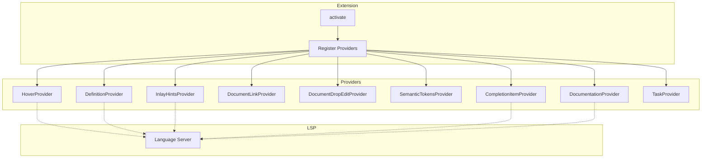

# Providers

VS Code language feature providers for GDScript and related file types.

## Architecture

## Provider Overview

### HoverProvider

File: `src/providers/hover.ts`

Shows documentation and type information on hover:

- Function signatures with parameters and return types
- Variable types with inferred type display
- `res://` path preview (shows file preview)
- Documentation from Godot classes

### DefinitionProvider

File: `src/providers/definition.ts`

Handles Go-to-Definition:

- Symbol definitions (functions, variables, classes)
- `res://` path links - opens referenced file
- Documentation symbol links

### InlayHintsProvider

File: `src/providers/inlay_hints.ts`

Shows inline type hints:

- Inferred variable types
- Parameter names in calls
- Configurable via `godotTools.inlayHints.gdscript` setting

### DocumentLinkProvider

File: `src/providers/document_link.ts`

Makes `res://` paths clickable:

- Links to referenced resources
- Links to scene files
- Handles relative path resolution

### DocumentDropEditProvider

File: `src/providers/document_drops.ts`

Handles drag-and-drop into editors:

- File drops create `res://` paths
- Drag from scene preview inserts node paths

### SemanticTokensProvider

File: `src/providers/semantic_tokens.ts` (currently disabled)

Provides semantic highlighting for:

- Node paths
- Resource paths
- Type-based coloring

### DocumentationProvider

File: `src/providers/documentation.ts`

Custom editor for `.gddoc` files:

- Built-in Godot class documentation
- Searchable class list via `godotTools.listGodotClasses`
- Rich HTML rendering with syntax highlighting

### CompletionItemProvider

File: `src/providers/completions.ts` (currently disabled)

Auto-completion provider (mostly handled by LSP).

### TaskProvider

File: `src/providers/tasks.ts`

Provides build tasks for Godot projects.

## Key Files

| File | Purpose |
|------|---------|
| `hover.ts` | Hover information display |
| `definition.ts` | Go-to-definition support |
| `inlay_hints.ts` | Inline type hints |
| `document_link.ts` | Clickable resource paths |
| `document_drops.ts` | Drag-and-drop handling |
| `documentation.ts` | Documentation viewer |
| `documentation_builder.ts` | HTML documentation generation |
| `completions.ts` | Autocomplete (disabled) |
| `semantic_tokens.ts` | Semantic highlighting (disabled) |
| `tasks.ts` | Build task provider |
| `index.ts` | Module exports |

## Context Keys

Providers use VS Code context keys for conditional enablement:

- `godotTools.context.connectedToLSP` - LSP connection status
- `godotTools.context.godotFiles` - List of Godot file language IDs
- `godotTools.context.sceneLikeFiles` - Scene/script file language IDs