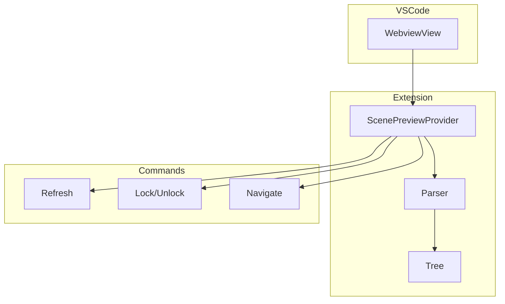

# Scene Tools

Scene preview and parsing for `.tscn` files.

## Architecture



## ScenePreviewProvider

File: `src/scene_tools/preview.ts`

Tree view showing scene structure for `.tscn` files.

### Features

- Hierarchical node tree display
- Click to navigate to scene file at node location
- Open associated script directly
- Open nested scenes
- Copy node paths and resource paths
- Lock/unlock to prevent auto-switching when switching files

### Tree Items

Each node in tree shows:

- Node type icon (from Godot icon set)
- Node name
- Associated script indicator if present
- Expandable for child nodes

## Parser

File: `src/scene_tools/parser.ts`

Parses `.tscn` files to extract structure.

### Parsed Elements

- `[gd_scene]` - Scene header
- `[node]` - Node definitions with:
  - `name` - Node name
  - `type` - Node class
  - `parent` - Parent node path
  - `instance` - Packed scene instance
- `[ext_resource]` - External resource references
- `[sub_resource]` - Sub-resources
- Script attachments

### Types

File: `src/scene_tools/types.ts`

```typescript
interface SceneNode {
  name: string;
  type: string;
  path: string;
  parentPath?: string;
  instance?: string;
  script?: string;
  children: SceneNode[];
}
```

## Key Files

| File | Purpose |
|------|---------|
| `preview.ts` | Tree view provider |
| `parser.ts` | Scene file parser |
| `types.ts` | TypeScript interfaces |
| `index.ts` | Module exports |

## Commands

- `godotTools.scenePreview.refresh` - Refresh current preview
- `godotTools.scenePreview.openCurrentScene` - Open the scene file
- `godotTools.scenePreview.openMainScript` - Open root node script
- `godotTools.scenePreview.lock` / `unlock` - Lock preview to current file
- `godotTools.scenePreview.goToDefinition` - Go to node class definition
- `godotTools.scenePreview.openDocumentation` - Open node class docs
- `godotTools.scenePreview.copyNodePath` - Copy node path to clipboard
- `godotTools.scenePreview.copyResourcePath` - Copy `res://` path
- `godotTools.scenePreview.openScene` - Open referenced scene
- `godotTools.scenePreview.openScript` - Open node's script

## Configuration

```json
{
  "godotTools.scenePreview.previewRelatedScenes": "sameFolder"
}
```

Options:
- `"anyFolder"` - Search entire workspace for related scenes
- `"sameFolder"` - Only search same folder (default)
- `"off"` - Don't auto-preview related scenes

## Notes

- Scene preview shows when `.tscn` file is open
- Works with Scene/Script switching (`Alt+O`)
- Handles both Godot 3 and Godot 4 scene formats
- External resources tracked for navigation