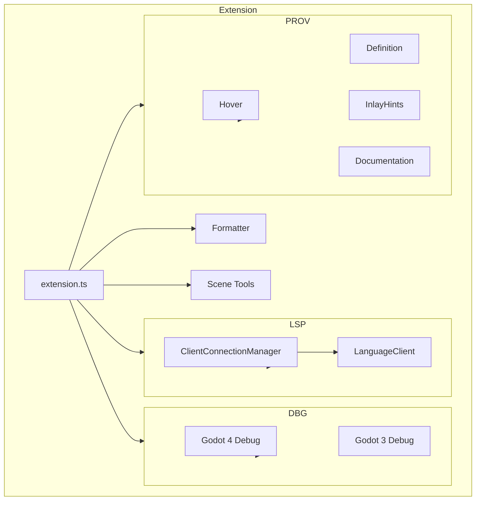

# Godot Tools VSCode Extension

A VS Code extension providing development tools for the Godot game engine. Supports both Godot 3.x and Godot 4.x.

## Core Capabilities

- **Language Server Protocol (LSP)**: Connects to Godot's built-in GDScript language server for autocomplete, diagnostics, and navigation
- **Debugger**: Full-featured GDScript debugger with breakpoints, variable inspection, scene tree view, and remote inspector
- **Scene Preview**: Visual tree representation of `.tscn` scene files with navigation to scripts and resources
- **Formatter**: Built-in GDScript code formatter with configurable style options
- **Documentation**: Built-in documentation viewer for Godot's native classes and member lookup

## Supported Languages

| Language | Extension | Features |
|----------|-----------|----------|
| GDScript | `.gd` | Syntax, LSP, formatting, debugger, docs |
| GDScene | `.tscn` | Syntax, scene preview, navigation |
| GDResource | `.tres`, `.godot`, etc. | Syntax, navigation |
| GDShader | `.gdshader` | Syntax highlighting |

## Key Files

- `src/extension.ts` - Extension entry point, registers all providers and commands
- `src/lsp/` - Language server client implementation
- `src/debugger/` - Debug adapter with Godot 3/4 variants
- `src/providers/` - VS Code language feature providers
- `src/formatter/` - GDScript code formatter
- `src/scene_tools/` - Scene preview and parsing

## Architecture

